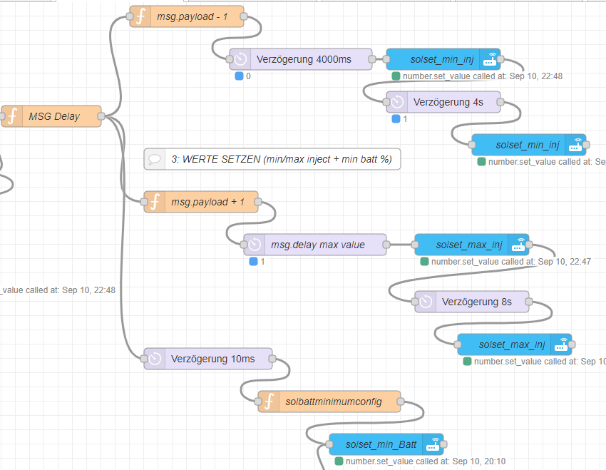

# Node Red Functions

## Überblick

* Einspeiseoptimierung mit Node-Red
* Alexa Integration
* IR Heizungsteuerung, Lüftung
* Licht: Dynamische Tagesabhängige Beleuchtung, Stimmungsbeleuchtung (WLED)
* Telegram Notifications
* Rauchmelder, Tür/Fenster Melder

## Einspeiseoptimierung (Nulleinspeisung)

* der PID-Regler Regelt die Einspeiseleistung auf 10 Watt Bezug (Minimalbezug).
    Nachdem ob EET nur "grob" auch das liefert, was eingestellt ist, Regelt das System die "min und max Einspeiseleistungsvorgaben" "etwas" nach.
* Bei jeder Änderung der Last (~, Maximal Einmal pro Minute) läuft die Analyse und der Regelkreis.
* EVN liefert ca. alle 6 Sekunden Leistungswerte via MQTT
* die Solmate API hab ich aktuell nur mit dem Setzen der Werte alle 60 sekunden gut im griff
* Lastwechsel (Kochen, Waschmaschine, Boiler, Wolken) führen also **spätestens nach einer Minute** zur **Neuregelung** und so kann es sein, das Tagsüber auch die Solmate via Akku liefert wird ;-)
* Akku Batterieschonungs-Limit ist im Mode Selekter auf minimal 9 % eingestellt.

* 1: alle HA relevaten leistungswerte werden mit "poll state" in global.variablenname gelesen (ca. alle 60 sek)
  * 
* 2: Modusroutine unterscheidet zwischen: Batteriestand niedrig, Aufladen, Liefern
  * 
  * Niedrig heißt: Wunsch: 90% Batterie
  * Aufladen heißt: 4 Watt Minimale Einspeisung, Wenn > 100 W Einspeisung Wunsch: 90% Batteriestand
  * Liefern, wenn, Bezug > 5 W oder PV-Lieferung > Verbrauch. => PID REGELUNG
* 3:  DANKE AN! https://github.com/mmattel/EET-Solmate

### code snipplets

* [PID-Regler](PID-Regler.js) = JAVASCRIPT PID REGELUNG
* [mode-selecter](mode-selecter.js)
* [more js code parts](pidmode-parts.md)
